# 导航

### [1.概述](#一.概述)
### [2.操作：安装TensorFlow，获取实例代码](#二.操作：安装TensorFlow，获取实例代码)
### [3.理论：训练神经网络](#三.理论：训练神经网络)
### [4.理论：单层神经网络](#四.理论：单层神经网络)
### [5.理论：梯度下降](#五.理论：梯度下降)
### [6.实验：一起跳入代码](#六.实验：一起跳入代码)
### [7.实验：添加层](#七.实验：添加层)
### [8.实验：特别当心深层网络](#八.实验：特别当心深层网络)
### [9.实验：学习速率衰减](#九.实验：学习速率衰减)
### [10实验：退出，过拟合](#十.实验：退出，过拟合)
### [11.理论：卷积网络](#十一.理论：卷积网络)
### [12.实验：一个卷积网络](#十二.实验：一个卷积网络)
### [13.实验：99%比赛](#十三.实验：99%比赛)
### [14.在强大硬件上的云中训练：ML引擎](#十四.在强大硬件上的云中训练：ML引擎)
### [15.恭喜](#十五.恭喜)

# 一.概述


在此实验中, 你将学习如何构建和训练一个神经网络以识别手写数字。一路上，当你提高你的神经网络实现99%精确度时，你会同时发现深度学习专业人士训练其模型的有效训练工具。

此实验使用MNIST数据集，六万个标记数字的集合，使几代博士一直忙了近二十年。你将使用少于一百行的Python/TensorFlow代码解决问题。

### 你将学到什么

- 什么是神经网络和如何训练它
- 如何使用TensorFlow构建一个基础的单层神经网络
- 如何添加更多的层
- 训练提示和技巧：过拟合、退出、学习速率衰减...
- 如何解决深层神经网络
- 如何构建卷积神经网络

### 你将需要什么
- Python 2 or 3 (推荐Python 3 )
- TensonFlow
- Matplotlib（Python可视化工具）

---

# 二.操作：安装TensorFlow，获取实例代码

在您的计算机上安装必要的软件：Python，TensorFlow和Matplotlib。完整的安装说明如下：<a href="https://github.com/GoogleCloudPlatform/tensorflow-without-a-phd/blob/master/tensorflow-mnist-tutorial/INSTALL.txt">INSTALL.txt</a>

克隆GitHub存储库：

```
$ git clone https://github.com/GoogleCloudPlatform/tensorflow-without-a-phd.git
$ cd tensorflow-without-a-phd/tensorflow-mnist-tutorial
```

> 本教程的示例代码位于tensorflow-mnist-tutorial文件夹中。该文件夹包含多个文件。你唯一能参加的是mnist_1.0_softmax.py。其他文件是用于加载数据和可视化结果的解决方案或支持代码。

当您启动初始python脚本时，您应该看到训练过程的实时可视化：

```
$ python3 mnist_1.0_softmax.py
```

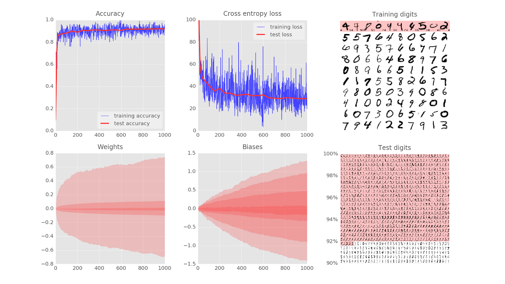

故障排除：如果您无法运行实时可视化，或者您更喜欢仅使用文本输出，则可以通过注释掉一行并取消注释另一行来取消激活可视化。请参阅文件底部的说明。

> 为TensorFlow构建的可视化工具是TensorBoard。它的主要目标是比我们在这里的需求更加雄心勃勃。它的构建使您可以跟踪TensorFlow在远程服务器上分布式作业。对于我们在这个实验室中需要的matplotlib会做什么，我们得到实时动画作为奖励。但是，如果您使用TensorFlow认真工作，请务必查看TensorBoard。

---
# 三.理论：训练神经网络
我们首先将观察正在训练的神经网络。代码将在下一章节中介绍，所以你现在不用看。

我们的神经网络接收手写数字并将其分类，即状态如果它识别出它们如a0,a1和a2直到a9。它基于内部变量（权重和biases，稍后解释）需要具有正确的分类值才能正常工作。此“正确值”是通过训练过程学习到的，同样之后详细解释。
> 训练数据 => 更新权重和biases => 更好的识别 (循环)

一起去通过逐个观察六个可视化面板，看看训练一个神经网络需要什么。

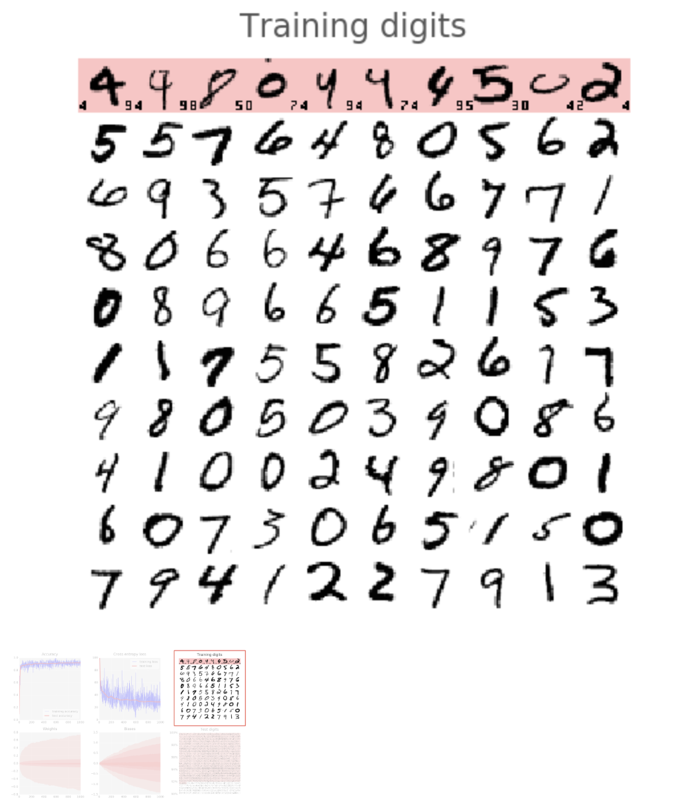

这里你将看到训练数字被送入训练循环，一次一百个。你也将看到如果神经网络在当前训练状态中，是否识别出它们（白色背景）或对它们错误分类（红色背景在左侧小字中代有正确标签，错误计算的标签在每个数字的右侧）。

> 这五万个在此数据集中的训练数字。我们每次迭代时将一百个数字送入训练循环，这样系统将在五百次迭代后看到所有训练数字。我们称之为“时期”。

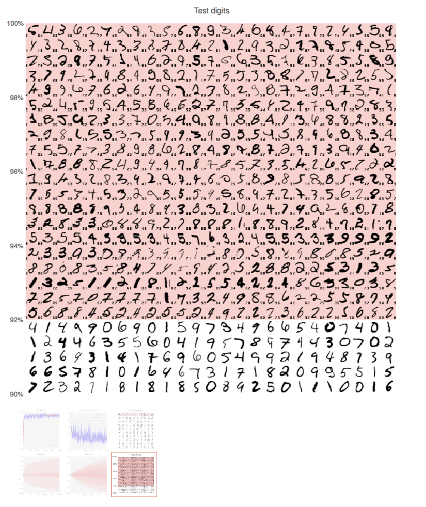

在真实条件下测试识别的质量，我们必须使用系统训练中未曾见过的的数字。否则，它可以用心学习所有训练数字，但仍然无法识别我刚才写的“8”。MNIST数据集包含一万个测试数字。在这里，你可以看到大约一千个，其中所有误识别的都排在顶部（红色背景上）。左侧的比例让你大致了解分类器的准确性（正确识别测试数据的百分比）

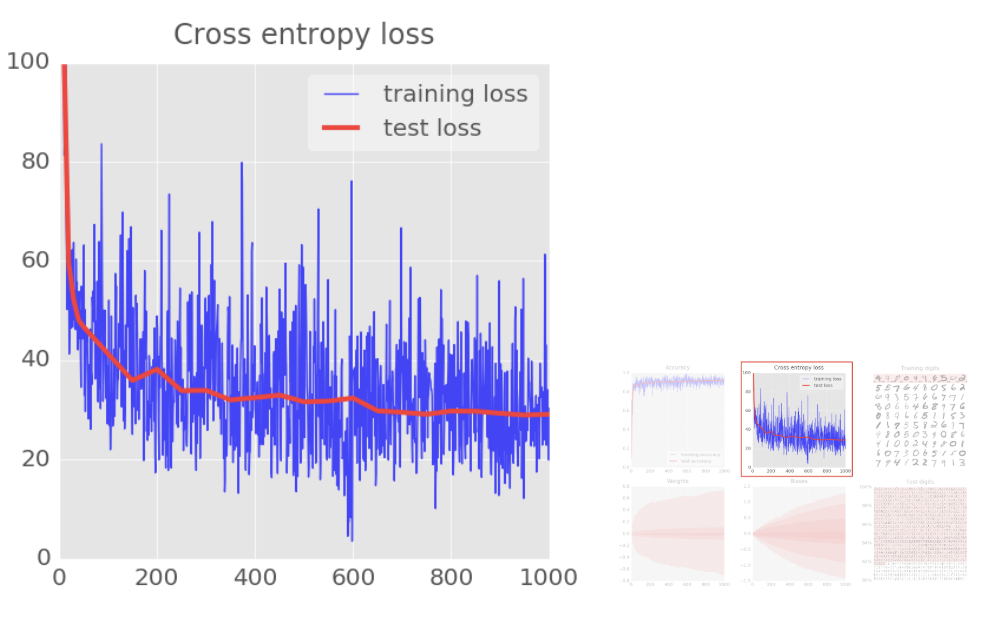

为了驱动训练，我们将定义一个损失函数，即一个值，代表系统识别数字误差程度，并尝试将它最小化。损失函数的选择（这里，“交叉熵”）将在后面讲解。你在这看到损失随训练和测试数据的训练进度而下降：那很好。它意味着神经网络在学习。x轴代表通过学习循环的迭代。

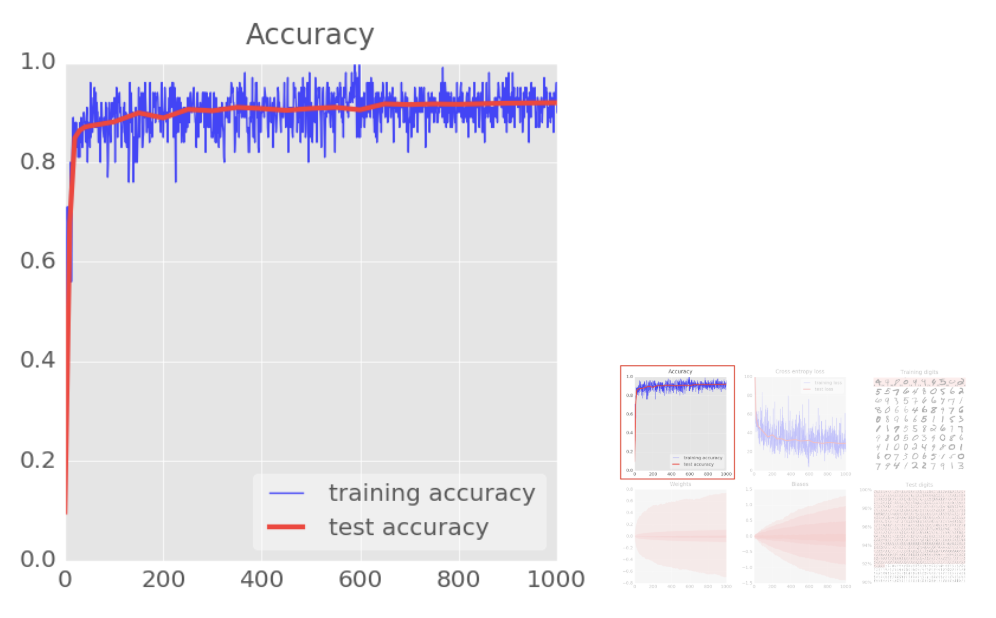

准确率是简单的正确识别数字的百分比。他是在训练和测试集合中计算得到的。你将看到它上升，如果训练向好。

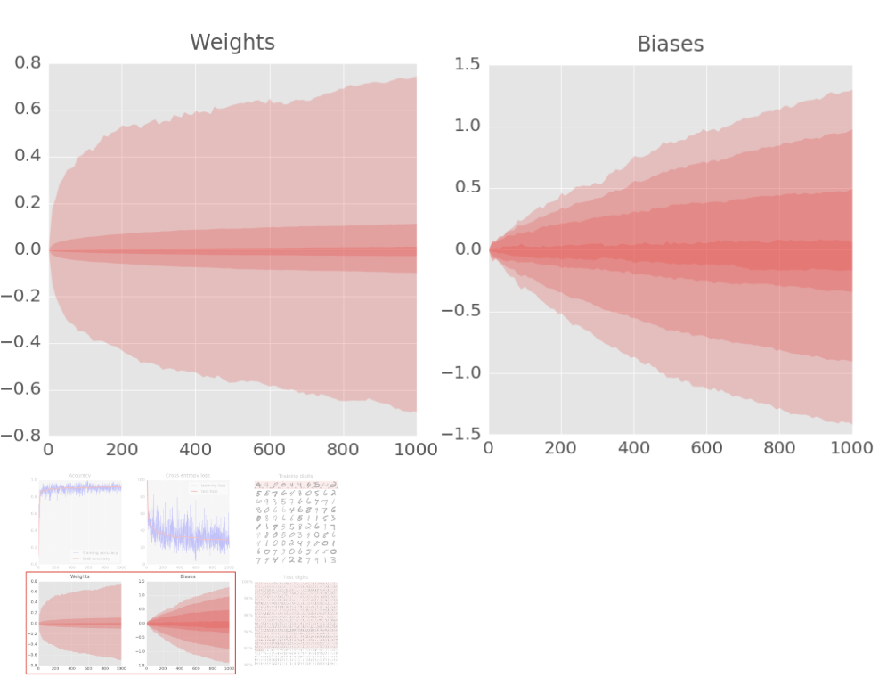

完成的两个图表代表内部变量采取所有值的传播，即权重和biases随训练的进程。这里你将看到样本biases最初从0开始并最终取值大致均匀分布在-1.5和1.5之间。如果系统收敛不好，这些图标可能很有用。如果你看到权重和biases扩散到100s或1000s时，你可能会遇到问题。

图中的条带是百分位数。这里7个条带，所以每个条带是所有值的100/7=14%。

> 可视化界面的快捷键：
> 1. ......仅显示第一个图表
> 2. ......仅显示第二个图表
> 3. ......仅显示第三个图表
> 4. ......仅显示第四个图表
> 5. ......仅显示第五个图表
> 6. ......仅显示第六个图表
> 7. ......仅显示第一和二个图表
> 8. ......仅显示第四和五个图表
> 9. ......仅显示第三和六个图表
> - ESC 或 0 ...... 退到显示所有图表
> - 空格 ...... 暂停/继续
> - o ...... 框缩放模式（当使用鼠标时）
> - h ...... 重置缩放
> - ctrl-s ...... 保存当前图

> 什么是权重和biases?什么是计算得交叉熵？训练算法纠结如何工作？跳至下一节找出。

---
# 四.理论：单层神经网络


手写数字在MNIST数据集中是28x28像素的灰度图。将它们分类的最简单方法是用28x28=784个像素作为单层神经网络的输入。

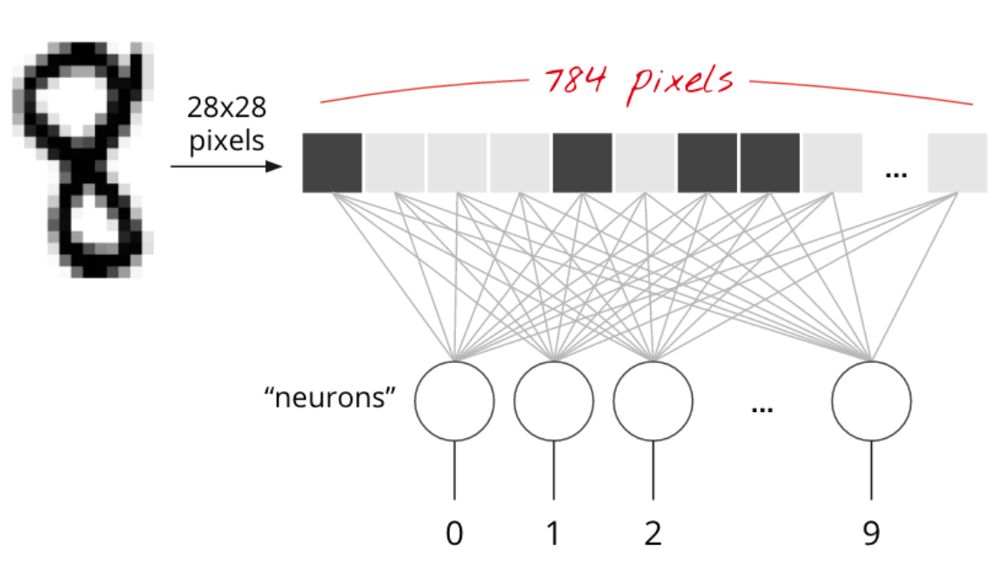

神经网络中的每个神经元对所有输入加权求和，添加一个称为“biases”的常量，然后通过一些非线性激活函数提供结果。

这里我们设计了一个单层神经网络，带有十个输出神经元，因为我们要将数字分类到十个类中(0到9).

对于分类问题，一个运行良好的激活函数是softmax。在矢量上应用softmax是通过取每个元素的指数然后归一化矢量（使用任何范数，例如矢量的普通欧几里得长度）来完成的。

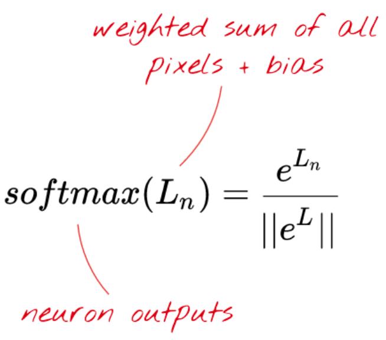

> 为什么“softmax”叫做softmax？指数是一个急剧增加的函数。它将增加向量元素之间的差异。它还可以快速生成大值。当您对矢量进行归一化时，最大的元素（其支配范数）将被归一化为接近1的值，而所有其他元素将最终除以较大的值并归一化为接近0的值。结果向量清晰的显示哪个是其最大元素“max”，但保留其值的原始相对顺序，因此“soft”。

我们现在使用矩阵乘法将这个单层神经元的行为概括为一个简单公式。让我们直接将一百个图片的“小批量”作为输入，产生一百个预测（十个元素的向量）作为输出。

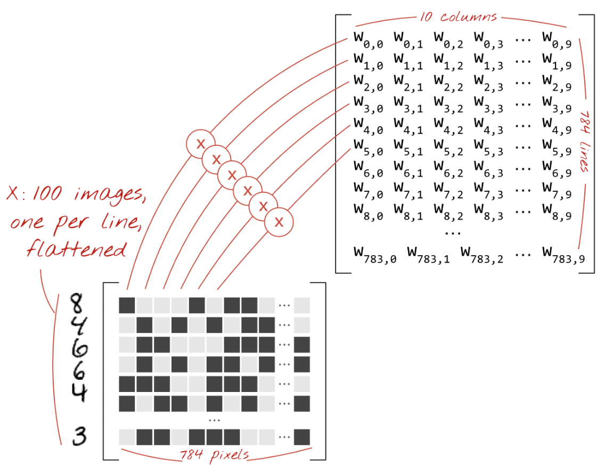

使用权重矩阵W中的第一列矩阵，我们计算第一张图的所有像素的加权和。该总和对应第一个神经元。使用第二列的权重，我们对第二列神经元做同样的事，以此类推直到第十个神经元。然后我们能重复操作其余的99个图片。如果我们将包含100个图片的矩阵称之为X，则在100个图片上计算所有10个神经元的加权和就是简单的XxW（矩阵乘法）。

现在每个神经元必须添加其biases（一个常量）。至此我们有10个神经元，10个biases常量。我们将称这10个值的向量为b。它必须添加到之前计算的矩阵的每一行。使用一些称为“广播”的魔法，我们将用一个简单的+号写这个。

> "广播"是一个在Python和numpy中使用的标准技巧，他是科学计算库。它扩展了在维度不兼容的矩阵上如何正常操作运行。“广播添加”意味着“如果你要添加两个矩阵，但你不能因为它们维度不兼容，尝试复制小的矩阵尽量使其工作”

我们最终应用softmax激活函数并获得描述单层神经网络的公式，应用到100个图片：

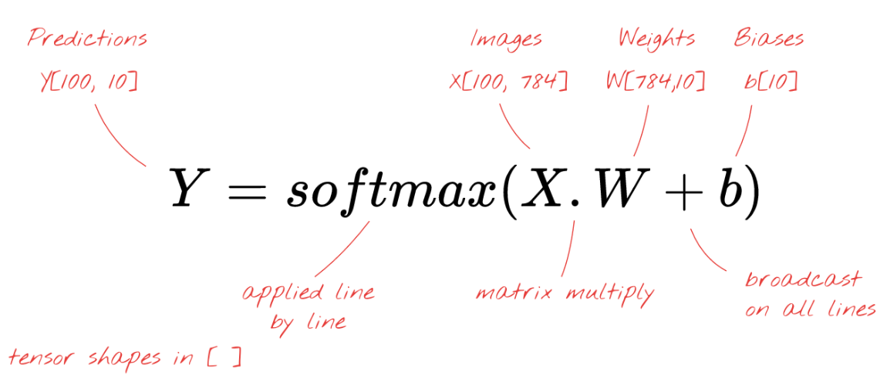

> 顺便说下，什么是“张量”？
> 张量类似矩阵，但有随意数量的维度。一个维度的张量是一个向量。两个维度张量是矩阵。并且你可以用3、4、5或更多维度到张量。

---
# 五.理论：梯度下降

现在我们的神经网络从输入图片产生预测，我们需要衡量它们有多好，即网络告诉我们和我们知道的真相之间到距离。记得我们有此数据集中所有图片到真实标签。

任何距离都可行，普通欧几里得距离就好，但对分类问题的一个距离，叫做“交叉熵”的更高效。

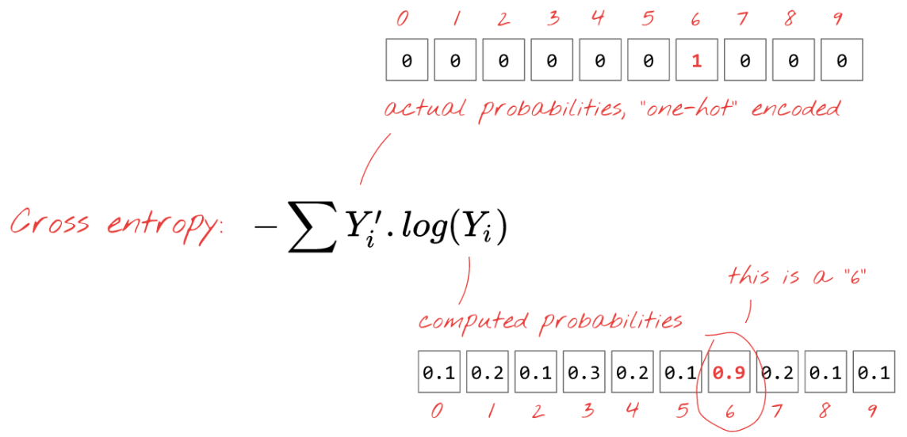

> "独热"编码意为你用一个10个值的向量表示标签“6”，所有值都是0，但第6个值是1，这很方便，因为格式非常类似于我们的神经网络输出的ts预测，也是10个值的向量。

“训练”神经网络实际意味着使用训练图片和标签来调整权重和biases，以便最小化交叉熵损失函数。这里是它如何工作。

交叉熵是权重、biases、训练图片像素和已知标签的函数。

如果我们计算交叉熵相对所有权重和biases的偏导数，我们获得“梯度”，他是针对给定图片、标签和权重和偏差的当前值计算所得。记得我们有7850个权重和biases，所以计算梯度听起来像是很多工作。幸好，TensorFlow为我们做了。

梯度的数学性质是它指向“上”，因为我们要到达交叉熵的低点，所以我们去反方向。我们用一个梯度函数更新权重和biases，并且使用下一批训练图片做相同的事。希望这能让我们去交叉熵为最小的坑的底部。

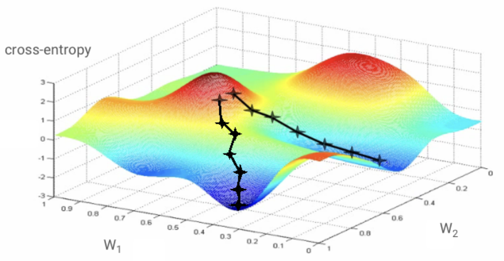

在此图中，交叉熵代表2个权重的函数。实际上更多。梯度下降跟随最陡路径到局部最小值。训练图片是在每个迭代时改变的，以便我们收敛到适用于所有图片的局部最小值。

> "学习速率"：你不能在每个迭代时按梯度的整个长度更新你的权重和biases。这样就像穿着七联赛的靴子试图到达山谷的底部。你将会从山谷的一侧跳到另一侧。要到达底部，你需要小步的做，即仅使用梯度的一小部分，通常在1/1000区域。我们称此函数为“学习速率”。

总结一下，这里是如何训练循环看起来这样：
> 训练数字和标签 => 损失函数 => 梯度（偏导数）=> 最陡下降 => 更新权重和biases => 重复下一个>小批量的训练图片和标签

> 为什么用100个图片和标签的“小批量”来工作。
>
> 你只能在一个样本图片上明确计算你的梯度并且立即更新权重和biases（在科学文献中称为“随机梯度下降”）。在100个样本上执行此操作会得到一个梯度，该梯度可以更好的表示不同样本图片所施加的约束，因此适合快速的收敛接近解决方案。尽管如此，小批量的大小是可调整的参数。另一个更技术性的原因：使用批量处理也意味着使用更大的矩阵，并且这些通常更容易在GPU上进行优化。

### 常见问题

<a href="https://jamesmccaffrey.wordpress.com/2013/11/05/why-you-should-use-cross-entropy-error-instead-of-classification-error-or-mean-squared-error-for-neural-network-classifier-training/" >为什么交叉熵适用于分类问题？</a>

---
# 六.实验：一起跳入代码

单层神经网络的代码已经写好。请打开mnist_1.0_softmax.py文件并按说明进行操作。

>你在本章的任务是明白起始代码，一边之后改进。

你将看到说明和文件中入门代码仅有细微差别。它们对应于用于可视化的功能，并为这些功能在注释中标记。你可以忽略它们。

### mnist_1.0_softmax.py
```Python
import tensorflow as tf

X = tf.placeholder(tf.float32, [None, 28, 28, 1])
W = tf.Variable(tf.zeros([784, 10]))
b = tf.Variable(tf.zeros([10]))

init = tf.initialize_all_variables()

```

首先我们定义TensorFlow变量和占位符。变量是你希望训练算法为你确定的所有参数。在我们的例子中，我们的权重和biases。

占位符是在训练期间将要填充实际数据的参数，通常是训练图片。持有训练图片的张量的形状是[None,28,28,1]表示；
- 28, 28, 1: 我们的图片是28x28x每个像素值（一个灰度）。彩色图片的最后一个数字是3，这里不是必须的。
- None：这个维度将是在小批量中图片的数量。它将在训练时知道。

### mnist_1.0_softmax.py
```Python
# 模型
Y = tf.nn.softmax(tf.matmul(tf.reshape(X, [-1, 784]), W) + b)
# 用于正确标签的占位符
Y_ = tf.placeholder(tf.float32, [None, 10])

# 损失函数
cross_entropy = -tf.reduce_sum(Y_ x tf.log(Y))

# 批量中找到正确答案的百分比
is_correct = tf.equal(tf.argmax(Y,1), tf.argmax(Y_,1))
accuracy = tf.reduce_mean(tf.cast(is_correct, tf.float32))
```
第一行是单层神经网络的模型。该公式是我们在之前理论章节建立的那个。**tf.reshape**命令将我们的28x28的图片转化到784个像素到单矢量中。重塑命令中“-1”表示“计算机，计算出的，这里只是一种可能性”。实践中，它将是小批量中图片的数量。

然后，我们需要额外的占位符来提供训练标签，这些标签将与训练图片一起提供。

现在我们有预测模型和正确标签，所以我们能计算交叉熵。**tf.reduce_sum**对向量所有元素的和。

最后两行计算正确识别数字的百分比。它们作为练习留给读者理解，使用TensorFlow API参考。你也可以跳过。

### mnist_1.0_softmax.py

```Python
optimizer = tf.train.GradientDescentOptimizer(0.003)
train_step = optimizer.minimize(cross_entropy)
```
这就是TensorFlow魔法发生的地方。你选择一个优化器（有许多可用）并要求它到最小化交叉熵损失。在这一步，TensorFlow计算了损失函数相对于所有权重和biases（梯度）的偏导数。这是一个正式的推到，而不是一个过于耗时的数字推导。

梯度是用于更新使用权重和biases的。0.003是学习速率。

终于，是时候运行训练循环了。到目前为止，所有TensorFlow指令都在内存中准备计算图，但尚未计算任何内容。

> TensorFlow的“延迟执行”模型：TensorFlow是为分布式计算构建的。在开始实际发送计算任务到各个计算机之前，它必须知道你要计算什么，你的执行图。这就是为什么它有一个延迟执行模型，你首次使用TensorFlow函数在内存中创建一个计算图，然后开始执行**Session**并使用**Session.run**执行实际计算。至此图表还不能被更改。<br/>
感谢此模型，TensorFlow可以接管分布式计算的大量后勤。例如，如果你指示它在计算机1上运行一部分计算，其余部分在计算机2上，它可以使必要数据传输自动发生。

计算需要将真实数据输入到你已经在你的TensorFlow代码中定义的占位符中，它以Python字典提供，其中键是占位符名称。

### mnist_1.0_softmax.py
```Python
sess = tf.Session()
sess.run(init)

for i in range(1000):
    # 加载批量图像和正确答案
    batch_X, batch_Y = mnist.train.next_batch(100)
    train_data={X: batch_X, Y_: batch_Y}

    # 训练
    sess.run(train_step, feed_dict=train_data)
```
当我们要求TensorFlow最小化交叉熵时，获得此处执行的**train_step**。这是计算梯度并更新权重和biases的步数。

最后，我们还需要计算几个值，以便我们能够了解模型的执行情况。

准确度和交叉熵是在训练循环（例如每10个迭代）中使用代码计算训练数据所得：
```Python
# success ?
a,c = sess.run([accuracy, cross_entropy], feed_dict=train_data)
```
同样可以通过在feed_dict中提供测试而不是训练数据，在测试数据上计算（例如，每100次迭代执行此操作。这是一万个测试数字，所以要需要一些cpu时间）。
```Python
# success on test data ?
test_data={X: mnist.test.images, Y_: mnist.test.labels}
a,c = sess.run([accuracy, cross_entropy], feed=test_data)
```
> TensorFlow和Numpy是好友：要准备计算图时，你仅操作TensorFlow张量和命令，如**tf.matmul, tf.reshape**......等等。<br/>
无论如何，只要执行**Session.run**命令，它返回的值是些Numpy张量，即Numpy可以使用的**numpy.ndarray**对象以及基于它的所有科学编译库。这就是为此实验构建的实时可视化，使用matploglib，这是一个基于Numpy的标准Python绘图库。

这个简单的模型已经识别92%的数字。不错，但你现在将显著改善它。
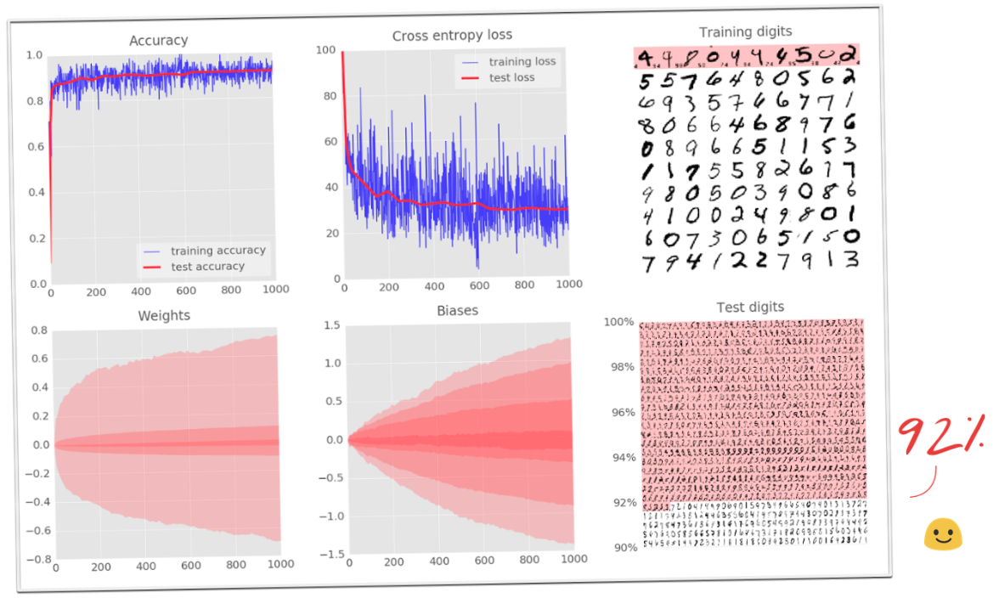

---
# 七.实验：添加层


为了提高识别准确率，我们将添加更多的层到神经网络。第二层的神经元，不是计算像素加权和，而是计算从上一层神经元输出的加权和。例如这是一个5层全联接神经网络：

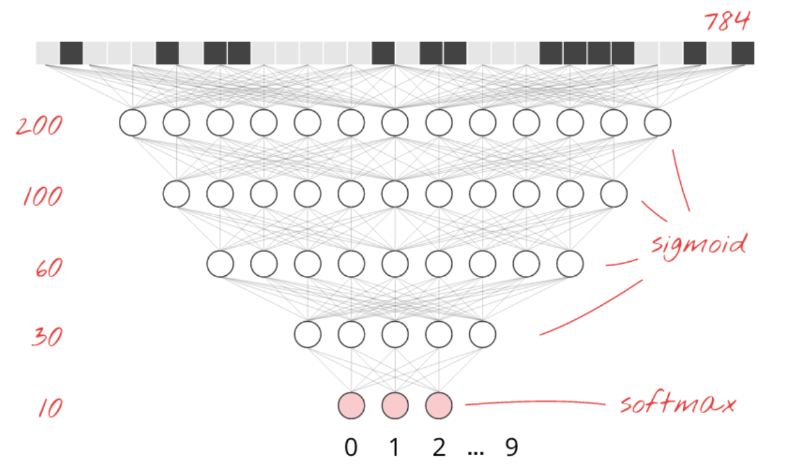

我们一直将softmax作为激活函数放在最后一层上，因为它对于分类做的最好。然而在中间层我们将使用最经典的激活函数：S形（sigmoid）：

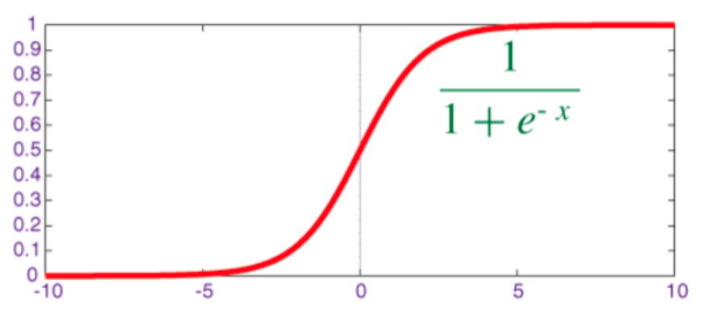

> 你在本节的任务是添加一个或两个中间层到你的模型，以提高它的性能。<br/>
<br/>
答案可以在**mnist_2.0_five_layers_sigmoid.py**文件中找到。如果你只是卡住了就用它！

要添加层，对于中间层你需要额外的权重矩阵和一个额外的biases向量：

```Python
W1 = tf.Variable(tf.truncated_normal([28x28, 200] ,stddev=0.1))
B1 = tf.Variable(tf.zeros([200]))

W2 = tf.Variable(tf.truncated_normal([200, 10], stddev=0.1))
B2 = tf.Variable(tf.zeros([10]))
```
一个层的权重矩阵形状是[N,M],N是输入的数量，M是层输出的。在上面代码中，我们使用200个神经元在中间层，并且任然在最后一层是10个神经元。

> 提示：当你深入，随机值初始化权重将变的重要。如果你没这么做，优化器会卡在初始位置。**tf.truncated_normal**是一个TensorFlow函数，用于产生跟随正常（高斯）分布于-2x标准差到+2x标准差的随机值。

现在更改你的单层模型到2层模型中：

```Python
XX = tf.reshape(X, [-1, 28x28])

Y1 = tf.nn.sigmoid(tf.matmul(XX, W1) + B1)
Y  = tf.nn.softmax(tf.matmul(Y1, W2) + B2)
```

这样，现在用2个中间层（200和100个神经元）你可以将你到网络准确率推至97%以上。

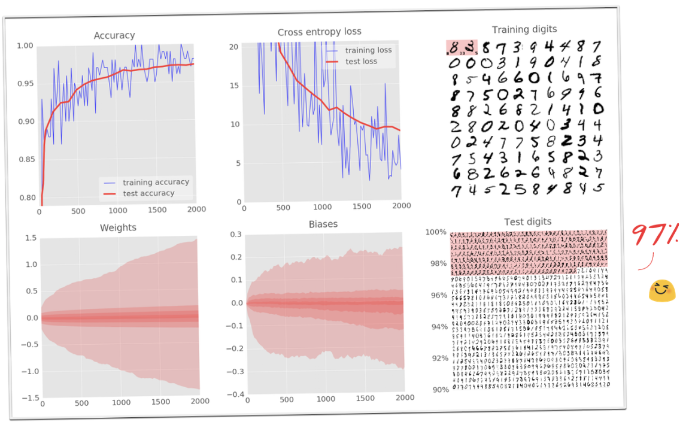

---
# 八.实验：特别当心深层网络


随着层的添加，神经网络的收敛会更加困难。但我们今天知道如何是他们表现出来。这有一对单线更新，如果你看到像这样一个准确的曲线，它将帮助你。

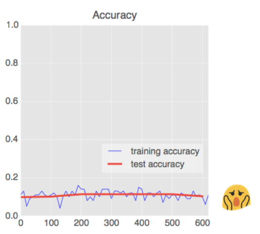

### RELU激活函数

sigmoid激活函数其实在深层网络中是相当困难的。它压缩所有值到0和1之间，当你这样反复这样做，神经元输出和它们的梯度会完全消失。他是提到的历史原因，但现代网络使用RELU（线性整流单元）看起来像这样：

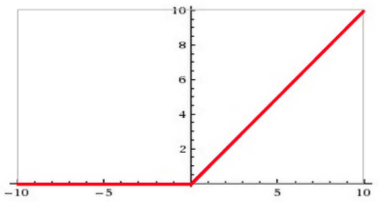

> 更新1/4:现在用RELUs替换你所有的sigmoids，你将获得更快的初始收敛，并在之后添加层时避免出现问题。简单的在你的代码里用**tf.nn.relu**替换**tf.nn.sigmoid**。

### 一个更好的优化器

在很高维空间中，像这样-我们有10k的权重和biases在列表中时，“鞍点”会频繁。这些点不是局部最低，但梯度还是0，并且梯度下降优化器会卡在那里。TensorFlow有完整可用优化器数组，包含一些惯性量并且将安然驶过鞍点。

> 更新2/4:现在用**tf.train.AdamOptimizer**替换你的**tf.train.GradientDescentOptimiser**。

### 随机初始化

准确率仍停留在0.1？你用随机值初始化你的权重了？对于biases，以RELUs处理时，最佳实践是将他们初始化为小的正值，以便神经元最初在RELU的非零范围内运行。

```Python
W = tf.Variable(tf.truncated_normal([K, L] ,stddev=0.1))
B = tf.Variable(tf.ones([L])/10)
```
> 更新3/4：检查现在你所有的权重和biases是否已适当初始化。如上图所示，0.1将用于biases。

### NaN???

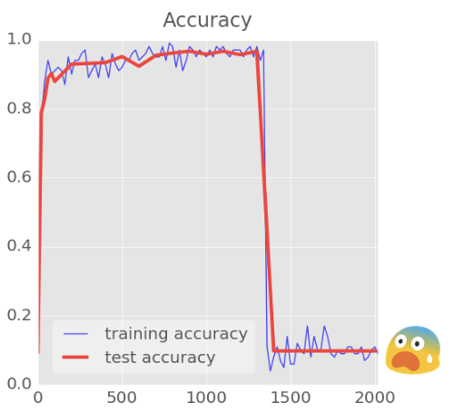

如果你看到你的精度曲线崩溃，并且控制台输出NaN作为交叉熵，不要慌，你尝试计算log(0),确定非数字（NsN）。记得交叉熵包含log，在softmax层的输出上计算。因为softmax实质上是一个指数，永远非零，我们应该没问题，但对于32位精度浮点运算，exp(-100)已是真正的零。

幸好，TensorFlow有便利的函数计算单步中的softmax和交叉熵，在数字稳定的方式中实施。要使用它，你需要在应用softmax之前在你的最后一个层上隔离原始加权和+biases(神经网络中的术语”logits“)。

如果你模型的最后一行是：

```Python
Y = tf.nn.softmax(tf.matmul(Y4, W5) + B5)
```

你需要用这些替换它：

```Python
Ylogits = tf.matmul(Y4, W5) + B5
Y = tf.nn.softmax(Ylogits)
```

并且现在你可以在一个安全的方式中计算你的交叉熵；

```Python
cross_entropy = tf.nn.softmax_cross_entropy_with_logits(logits=Ylogits, labels=Y_)
```

还有添加此行以使测试和训练交叉熵以相同比例显示：

```Python
cross_entropy = tf.reduce_mean(cross_entropy)x100
```

> 更新4/4:请添加**tf.nn.softmax_cross_entropy_with_logits**到你的代码。你也可以跳过此步，并且当你确实看到NaNs在你的输出中时回到这。

你现在准备深入了解。

---
# 九.实验：学习速率衰减


有2、3或4个中间层，你现在能接近98%准确率，如果你推动迭代到5000或之外，但你将看到结果非常不一致。

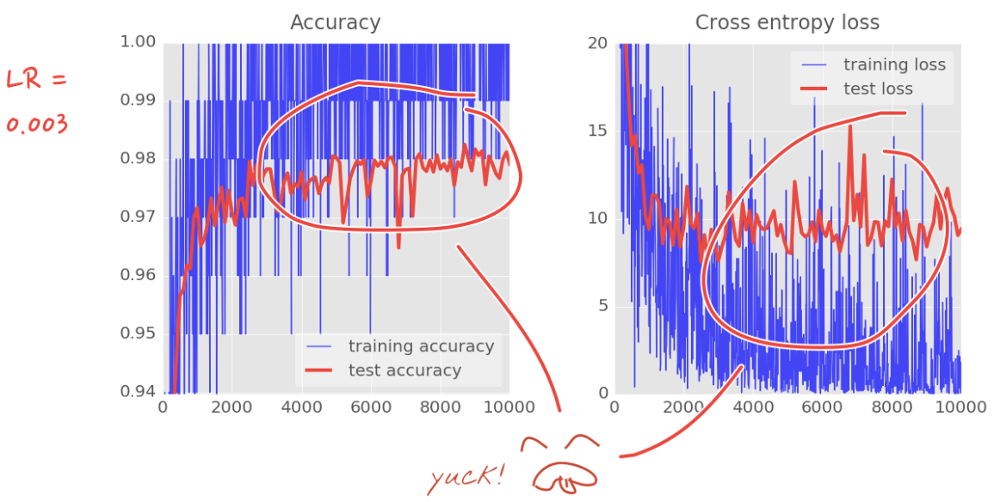

这些曲线确实杂乱，同时看下测试准确度：它上下跳动整整一个百分点。这意味着即使0.003到学习速率，我们也会走到太快。但我们不能仅仅将学习速率除以10，活着训练将带入永远。好的方案是例如快速启动并且将学习速率指数级衰减到0.0001。

小改变到碰撞是可观的。你看到大量到燥点消失并且测试精度持续的方式中超过98%。

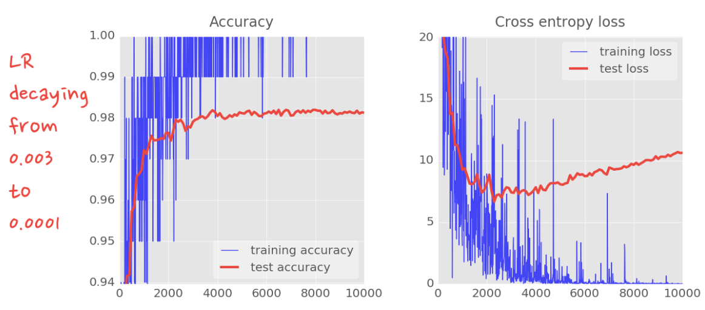

载看下训练精度曲线。它现在到达100%穿过几个时期（1个时期=500个迭代=在所有训练图片上训练一次）。首次，我们能够学习到完美识别训练图片。

> 请添加学习速率衰减到你的代码。在你的模型中，使用以下公式代替我们之前在AdamOptimizer中使用的固定学习速率。
<br/>
**lr = 0.0001 + tf.train.exponential_decay(0.003, step, 2000, 1/math.e)**
<br/>
它实践了学习速率从0.003到0.0001呈指数衰减。<br/>
你将需要在每个迭代时通过**feed_dict**参数将step参数传递给模型。你将像这样需要一个新的占位符：
<br/>
**step = tf.placeholder(tf.int32)**
<br/>
解决方案可以在** mnist_2.1_five_layers_relu_lrdecay.py**文件中找到。如果你卡住了就用它。

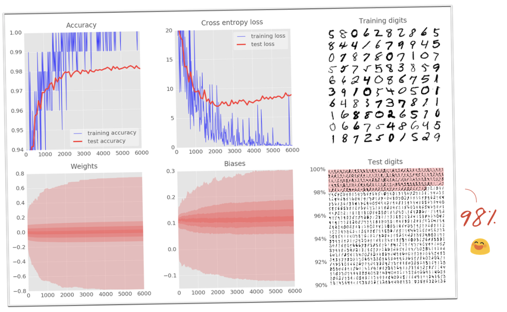

---
# 十.实验：退出，过拟合


你将注意到，测试和训练数据的交叉熵曲线在几千次迭代后开始断开连接。学习算法仅用于训练数据，并且优化相应的训练交叉熵。它永远看不到测试数据，所以一段时间后它到工作不再对测试交叉熵产生影响酒不足为奇了，它会停止下降，有时甚至会反弹回来。

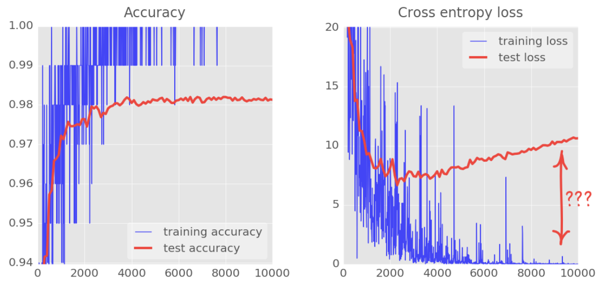

这不会立即影响模型的真实识别功能，它会避免你运行太多迭代，这通常表明训练不再具有积极作用。此断开通常标记为“过拟合”，当你看到它时，你可以尝试应用陈伟“dropout”的正则化技术。

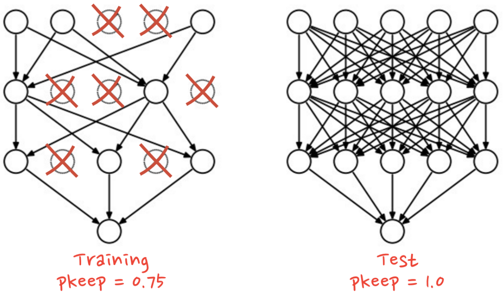

在dropout中，在每次训练迭代中，你从网络中丢弃随机神经元。您选择一个保留神经元的pkeep概率，通常在50％和75％之间，然后在训练循环的每次迭代中，您随机移除具有所有权重和biases的神经元。每次迭代都会丢弃不同的神经元（并且你还需要按比例放大剩余神经元的输出，以确保下一层的激活不会发生变化）。当你测试你的网络性能时，当然你会把所有的神经元都放回去（**pkeep=1**）。

TensorFlow提供了一个用于单层神经元输出的dropout函数。它会随机将某些输出归零，并将剩余的输出提高1 / pkeep。以下是在2层网络中使用它的方法：

```Python
# feed in 1 when testing, 0.75 when training
pkeep = tf.placeholder(tf.float32)

Y1 = tf.nn.relu(tf.matmul(X, W1) + B1)
Y1d = tf.nn.dropout(Y1, pkeep)

Y = tf.nn.softmax(tf.matmul(Y1d, W2) + B2)
```

> 您现在可以在网络中的每个中间层之后添加dropout。如果您按下时间继续阅读，这是实验室中的可选步骤。
<br/>
解决方案可以在文件(mnist_2.2_five_layers_relu_lrdecay_dropout.py)中找到.如果你被困住就用它。

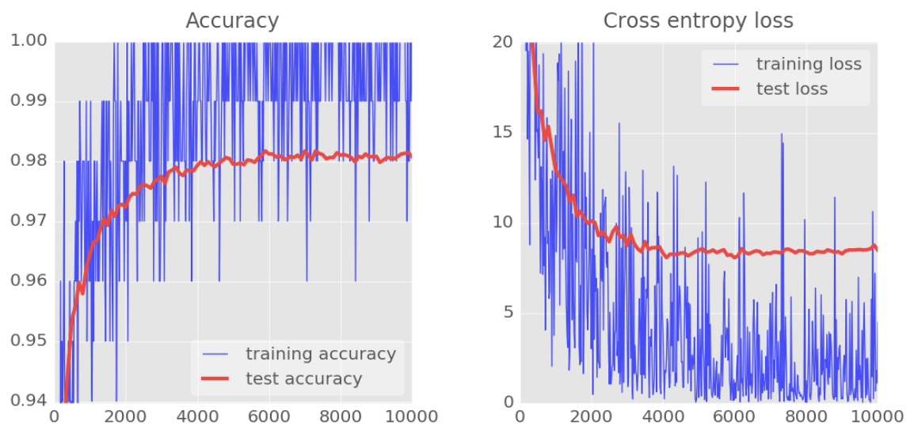

您应该看到测试损失大部分被带回控制之下，干扰再次出现（不出意外地给出了如何droout工作），但至少在这种情况下，测试精度保持不变，这有点令人失望。必须有另一个“过度拟合”的原因。
<br/>
在我们继续之前，回顾一下迄今为止我们尝试过的所有工具：

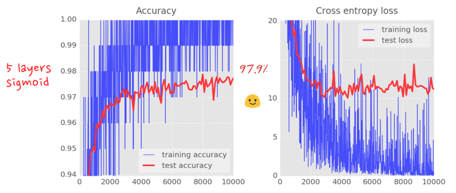

无论我们做什么，我们似乎都无法以显着的方式突破98％的屏障，并且我们的损失曲线仍然表现出“过拟合”的断开。什么是“过度拟合”？过拟合发生在神经网络学习不好时，在训练样本中适合但在真实数据上不太好的方式，有一些正规化技术，如dropout，可以迫使它以更好的方式学习，但过度拟合也有更深层次的根源。

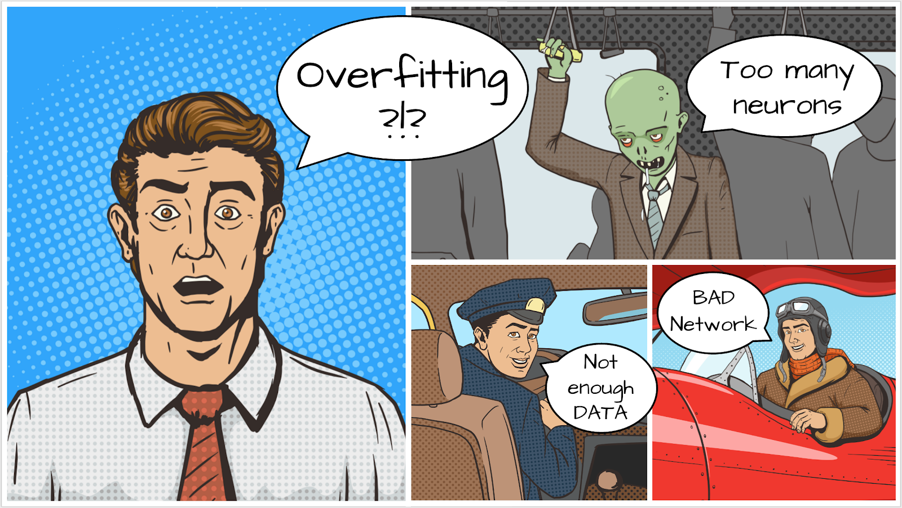

当神经网络对于手头的问题具有太多的自由度时，就会发生基本过度拟合。想象一下，我们有这么多神经元，网络可以将所有训练图像存储在其中，然后通过模式匹配识别它们。它会在现实世界的数据上完全失败。神经网络必须受到某种程度的约束，以便强制归纳它在训练期间学到的东西。

如果您的训练数据很少，即使是小型网络也可以用心去学习。一般来说，您总是需要大量数据来训练神经网络。

最后，如果你一切做得很好，试验不同大小的网络，以确保其自由度受到限制，应用dropout，并对大量数据进行过训练，您的威力可能仍会卡在性能级，似乎无法改善。这意味着您的神经网络目前的形状无法从您的数据中提取更多信息，如我们的案例所示。

还记得我们如何使用我们的图像，将所有像素扁平成单个矢量？这是真是个坏主意。手写数字由形状组成，我们在扁平像素时丢弃了形状信息。然而，有一种神经网络可以利用形状信息：卷积网络。让我们试试吧。

---
# 十一.理论：卷积网络


在卷积神经网络的层中，一个“神经元”仅在图像的一个小区域上对其正上方的像素进行加权求和。然后它的默认行为通过添加biases并通过其激活功能供养结果。最大的区别是每个神经元重复使用相同的权重，而在之前看到的完全连接的网络中，每个神经元都有自己的一组权重。

在上面的动画中，您可以看到通过在两个方向（卷积）上滑动权重块穿过图像，您可以获得与图像中的像素一样多的输出值（尽管边缘处需要一些填充）。

要使用4x4大小的块和一个彩色图像作为输入生成一个输出值平面，如在动画中，我们需要4x4x3 = 48个权重。这还不够。为了增加更多的自由度，我们用不同的权重集重复同样的事情。

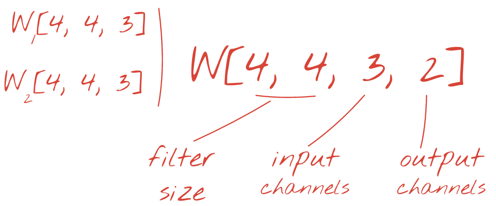

通过向张量添加维度，可以将两组（或更多组）权重改写为一组，这给出了卷积层的权重张量的通用形状。由于输入和输出通道的数量是参数，我们可以开始堆叠并链接卷积层。

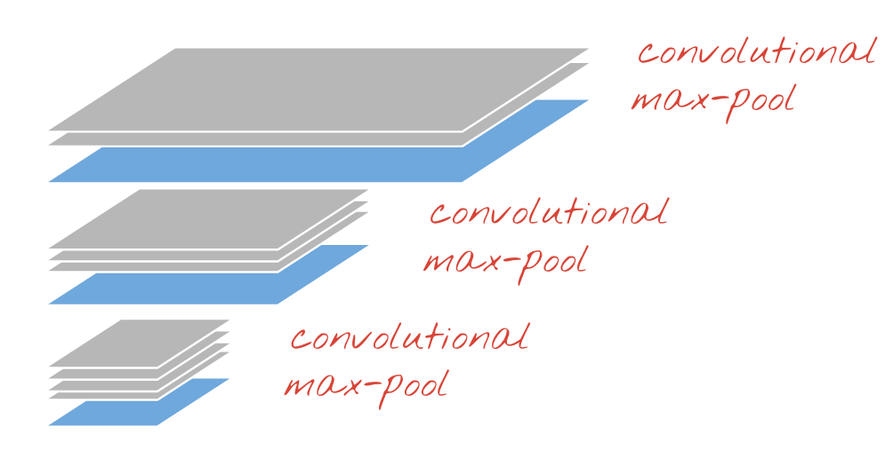

最后一个遗留问题。我们仍然需要将信息归纳。在最后一层，我们仍然只需要10个神经元来处理10类数字。传统上，这是通过“max-pooling”层完成的。即使今天有更简单的方法，“max-pooling”有助于直观地理解卷积网络的运作方式：如果你假设在训练期间，我们的权重块演变成可识别基本形状（水平和垂直线条，曲线......）的过滤器，然后归纳出有用信息的一种方法是通过层保持最大强度识别形状的输出。在实践中，在max-pool层中，神经元输出以2x2的组处理，并且仅保留一个最大值。

但有一种更简单的方法：如果您使用2个像素而不是1的步幅在图像上滑动块，您也获得较少的输出值。事实证明这种方法同样有效，并且今天的卷积网络只使用卷积层。


让我们建立一个手写数字识别的卷积网络。我们将在顶部使用三个卷积层，在底部使用传统的softmax读出层，并将它们与一个完全连接的层连接：

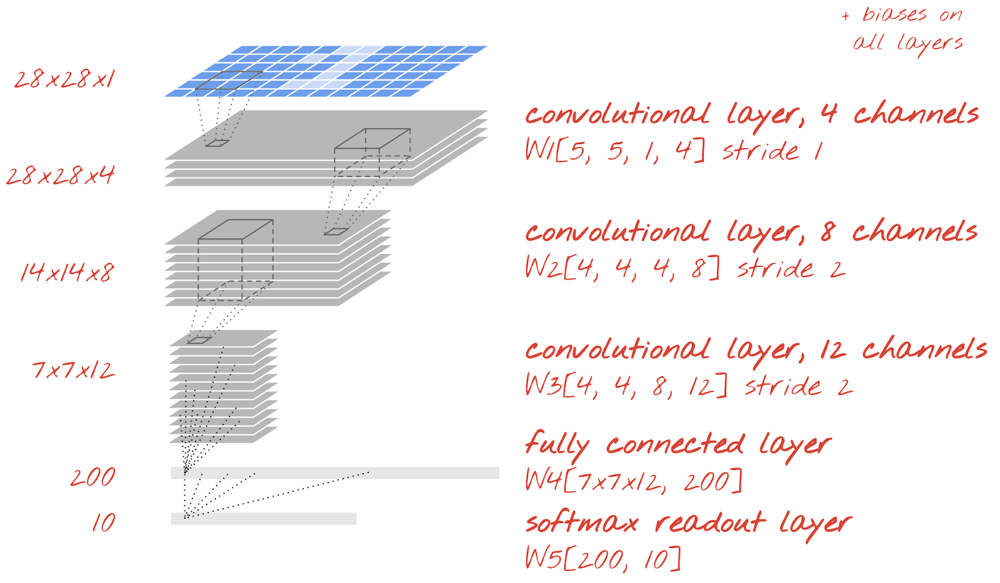

请注意，第二个和第三个卷积层的步长为2，这就解释了为什么它们将输出值的数量从28x28降低到14x14然后降低到7x7。完成层的大小调整，使每层神经元的数量大约下降两倍：28x28x4≈3000 → 14x14x8≈1500 → 7x7x12≈500 → 200.跳转到下一部分实现。

---
# 十二.实验：一个卷积网络


要将我们的代码切换到卷积模型，我们需要为卷积层定义适当的权重张量，然后将卷积层添加到模型中。

我们已经看到卷积层需要以下形状的权重张量。以下是用于初始化的TensorFlow语法：

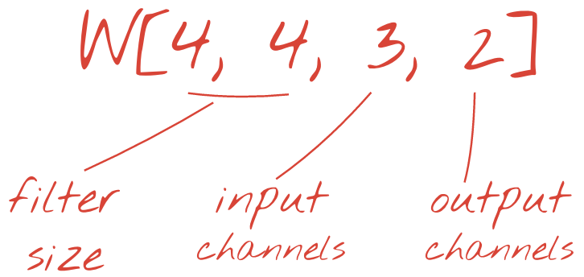

```Python
W = tf.Variable(tf.truncated_normal([4, 4, 3, 2], stddev=0.1))
B = tf.Variable(tf.ones([2])/10) # 2 is the number of output channels
```

可以使用tf.nn.conv2d函数在TensorFlow中实现卷积层，该函数使用提供的权重在两个方向上扫描输入的图像。这只是神经元的加权和部分。您仍然需要添加偏差并通过激活函数提供结果。

```Python
stride = 1  # output is still 28x28
Ycnv = tf.nn.conv2d(X, W, strides=[1, stride, stride, 1], padding='SAME')
Y = tf.nn.relu(Ycnv + B)
```

不要过分关注步幅的复杂语法。查找文档以获取完整详情。这里的填充策略是从图像的两侧复制像素。所有数字都在统一的背景上，因此这只会扩展背景，不应添加任何不需要的形状。

> 轮到你了。修改模型以将其转换为卷积模型。您可以使用上图中的值来调整它的大小。你可以保持你的学习速率衰减值，但请在此时删除dropout。
<br/>
解决方案可以在文件中找到**mnist_3.0_convolutional.py**。如果你卡住使用它。

你的模特应该能够轻松打破98％的屏障，最终只能达到99％以下的头发（图表中训练精度形似头发）。我们不能这么近！看看测试交叉熵曲线。你的脑海里有一个解决方案吗？

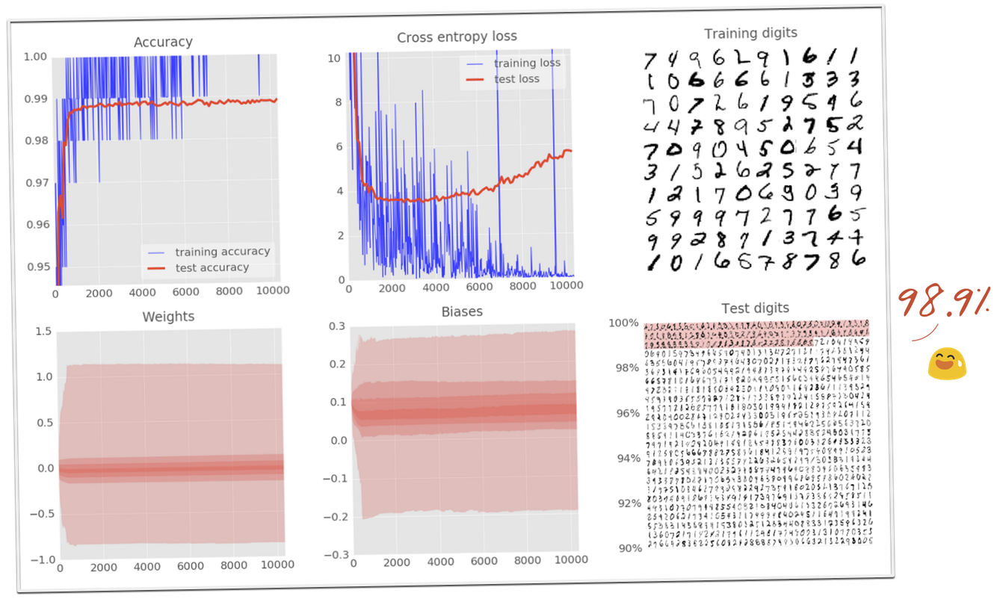

---
# 十三.实验：99%比赛

调整神经网络大小的一个好方法是实现一个有点过于受限的网络，然后给它一点自由度并添加dropout以确保它不会过拟合。这最终会为您的问题提供一个相当优化的网络。

这里举个例子，我们在第一个卷积层中只使用了4个补丁。如果您接受这些权重补丁在训练期间进化为形状识别器，您可以直观地看到这可能不足以解决我们的问题。手写数字模型来自超过4种基本形状。

因此，让我们稍微提高补丁大小，将卷积层中的补丁数量从4,8,12增加到6,12,24，然后在完全连接层上添加dropout。为什么不在卷积层？其神经元复用相同权重，因此在一次训练迭代期间通过冻结一些权重来有效地工作，这样dropout不适用与它们。

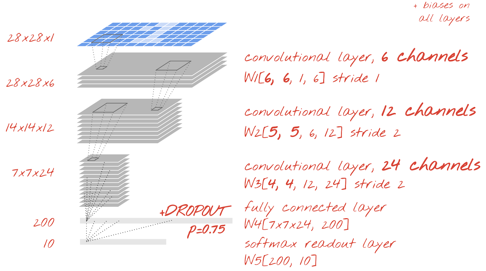

> 去吧，打破99％的限制。如上图所示增加补丁大小和通道数量，并在卷积层上添加dropout。
> <br/>
> 解决方案可以在文件中找到**mnist_3.1_convolutional_bigger_dropout.py**。如果你卡住使用它。

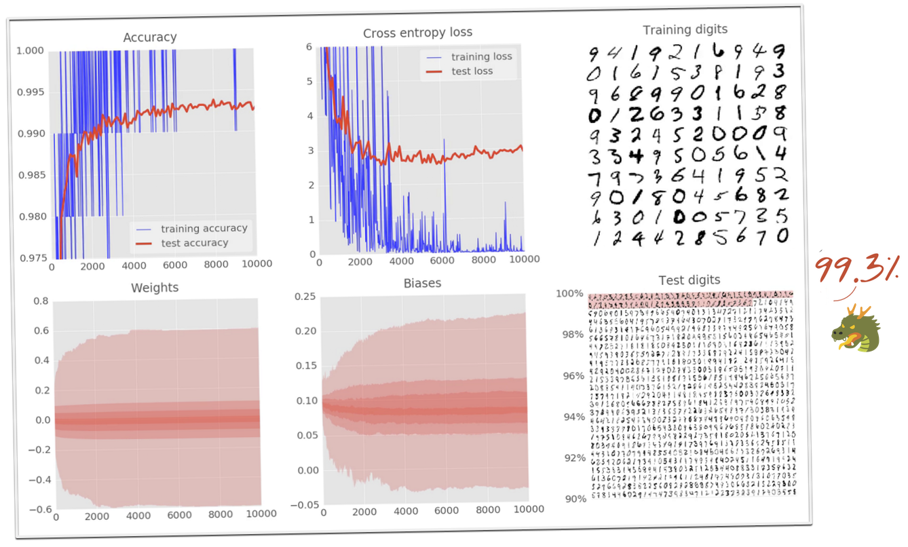

上图所示的模型在10,000个测试数字中仅丢失了72个。您可以在MNIST网站上找到的世界纪录大约为99.7％。我们的模型使用100行Python / TensorFlow构建，距离它只有0.4个百分点。

总而言之，这是不同的dropout做到了我们更大的卷积网络。为神经网络提供额外的自由度，使最终精度从98.9％提高到99.1％。增加dropout不仅驯服了测试损失，而且让我们安全航行超过99％，甚至达到99.3％。

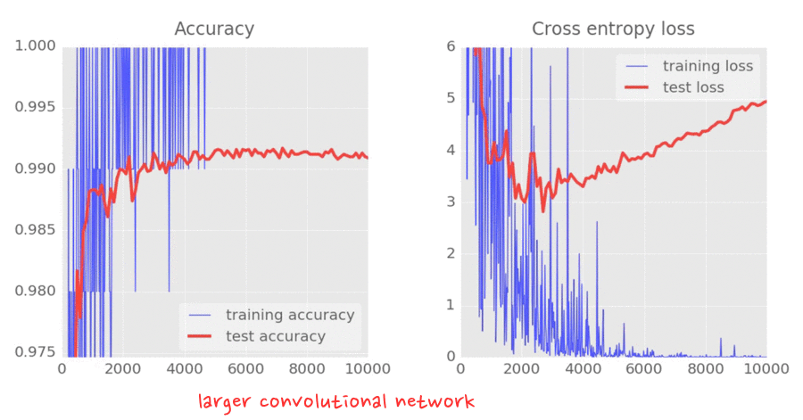

---
# 十四.在强大硬件上的云中训练：ML引擎

您将在GitHub上的mlengine文件夹中找到支持云的代码版本，按照说明在Google Cloud ML Engine上运行它。在运行此部分前，您必须创建Google Cloud帐户并启用结算功能。完成实验室所需的资源应少于几美元（假设一个GPU上的训练时间为1小时）。准备帐户：
1. 创建Google Cloud Platform项目(http://cloud.google.com/console)
2. 启用结算功能
3. 安装GCP命令行工具(<a href="https://cloud.google.com/sdk/downloads#interactive">GCP SDK here</a>)
4. 创建一个Google Cloud Storage存储桶（放在us-central1区域）。它将用于分阶段训练代码并存储您的训练模型。
5. 启用必要的API并请求必要的配额（运行一次训练命令，您应该收到错误消息，告诉您如何启用）
---
# 十五.恭喜

您已经构建了第一个神经网络，并将其一直训练到99％的准确度。沿途学到的技术并非特定于MNIST数据集，实际上它们在使用神经网络时被广泛使用。作为临别礼物，这里是实验室的“悬崖笔记”卡片，卡通版。你可以用它来记住你学到的东西：

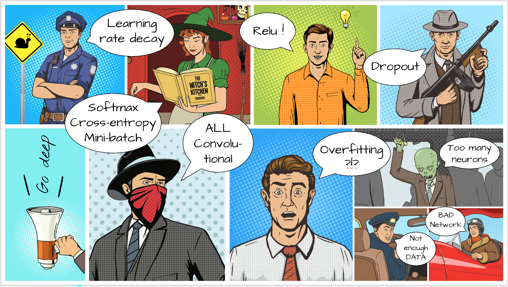

### 下一步

- 在完全连接和卷积网络之后，您应该看看<a href="https://youtu.be/fTUwdXUFfI8">递归神经网络</a>。
- 在本教程中，您学习了如何在矩阵级别构建Tensorflow模型。 Tensorflow具有更高级别的API，也称为tf.layers。
- 为了在分布式基础架构上的云中运行您的训练或推理，Google提供了Cloud ML Engine服务。
- 最后，我们喜欢反馈。如果您在本实验室中看到有什么不妥之处或者您认为应该改进，请告诉我们。我们通过GitHub问题处理反馈。

---
